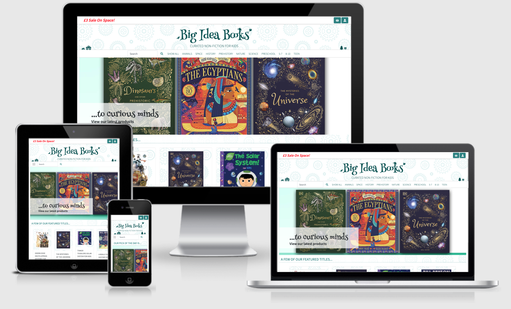
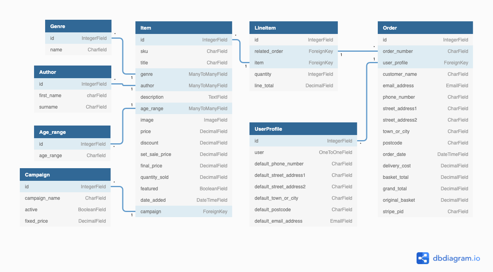
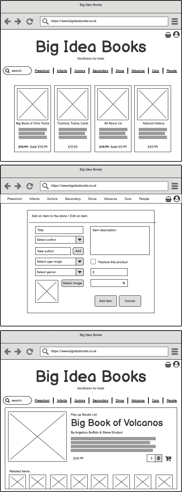

# **Big Idea Books:** Curated Non-fiction For Kids



[Go to site: ms4-big-idea-books.herokuapp.com](https://ms4-big-idea-books.herokuapp.com/)

# Strategy
Big Idea Books is a bookselling website specialising in non-fiction titles for children. The site is targeted to anyone buying for a child from preschool age up to early teen. It is expected that this will be mainly parents, but the site's UX has been carefully considered to guide customers to age-appropriate titles in a given area of interest: for example, prehistory for 8-10s or animals for preschoolers. It does this through intuitive navigation; creating a clear and simple customer journey.

For the store owner the content management system is designed with ease of use and flexibility in mind. Titles can be created or updated directly from a home page navigation link, and can also be deleted directly from search results. The system does not force the user to adhere to particular pricing structures or sales campaign models; the site owner can add percentage discounts or fixed sale prices as they wish, and all totals will be calculated for them.

The business case for this was inspired by my own experience of buying books for children. While plenty of other book-buying options existing online, I've found that most are overwhelmingly focussed on fiction, whereas my two young sons are die-hard non-fiction fans. Of course the non-fiction titles are easy to search for if you know their titles, but when browsing for something new the sorting and filtering options are often not specific enough for my requirements. Amazon offers users the ability to filter results by age and subject, but it has such an extensive catalogue that it is overwhelming and often includes titles that have been too broadly categorised, for example, 'Trains' strongly suggests that it will be largely non-fiction, but for a busy mum, it would be far prefereable to be able to specify that, rather than have to sift through the likes of 'Thomas The Tank Engine' to find the more suitable 'How Trains Work'.

Waterstones work much better in respect of above comments. However, it too features an overwhelmingly large catalogue that is time-consuming to sort through, and also suffers from being too broadly categorised.

It is understandable that these giants within their sector would suffer from the relatively positive problem of too large a choice of stock, and therefore Big Idea Books does not aim to take them on or even attempt to better their customer journey. What Big Idea Books does aim to do is offer parents and gift-buyers an alternative and straightforward to solution to finding beautifully written and designed non-fiction; almost a 'personal-shopper' experience. The tagline 'Curated Non-fiction For Kids' spells out the store's aims precisely; these are items that have been carefully selected for inclusion in the cataloge and displayed to the user under appropriate filters to give customers a clear and straightforward shopping experience.

# Scope

The below table outlines the 22 application features that I consider essential for a minimum viable product, all of which will are planned for implementation in from the earliest development stages.

| User story ID	| As a... |	I want to be able to... | So that I can... |
| ----------| ------|---------|---------|
|--|--|**Viewing & Selecting Products** |---|
| 1 |	customer |	view all of the products |	select and buy one or more |    
| 2	| customer |	read about the products in detail |	find out the price, author, subject and suggested age recommendation and read the description.| 
| 3	| customer |	search by keyword | quickly find exactly what I'm looking for |
|--|--|**Sorting & Filtering Products** |---|
| 4 |	customer |	filter items by genre and age recommendation | identify the most suitable item to buy |
| 5 |	customer |	sort search and filter results by price	find a suitable product within my price range | |
|--|--|**Managing My Basket Items** |---|
| 6	| customer	 | add a number of items to my basket directly from the search results | buy items when I see them, without clicking through to individual item details pages |
| 7	| customer |	add one or more of the same item from the item detail page | buy what I want without navigating back to the search results |
| 8	| customer |	remove items from my basket	| change my mind at the checkout |
| 9	| customer |	change the quantity of items from within my basket | buy more or less of something without navigating back through the item listings |
| 10 |	customer |	see my basket contents and total from wherever I am on the site	| avoid overspending |
|--|--|**Making Payment** |---|
| 11 |	customer |	pay for my items without leaving the site | have a simpler customer journey from start to finish |	 
| 12 |	customer |	be notified if there is an issue with my payment | easily identify and rectify the issue |
|--|--|**My Account & Information** |---|
| 13 |	customer |	view my order history |	check what I've bought and how much I've spent |
| 15	| customer |	save my address details	| don't have to re-enter it every time I visit |
| 16	| customer |	log in and out from any page |	feel certain no-one else is able to view my account |
| 17	| customer |	change my password |	manage my account's security |
| 18	| site owner | 	add an item to the store |	quickly add new products as soon as they are available |
|--|--|**Managing The Store's Content** |---|
| 19	| site owner	| update an existing item	 | keep product information up-to-date |
| 20	| site owner	| delete and item from the store |	remove items that are no longer needed on the store |
|--|--|**Building Sales Campaigns**|--|--|
| 21 | site owner | create a sales campaign | boost site revenue |
| 22 | site owner | enable and disable campaigns in one click | have a flash sale for short periods without much admin overhead |


The table below outlines those features that are 'nice-to-have' and not essential to the succesful launch of the MVP, as outlined above. These features may or may not be implemented, depending on the scope of the initial development stage.

| User story ID	| As a... |	I want to be able to... | So that I can... |
| ----------| ------|---------|---------|
| 24	| site owner	| add, delete and update authors via the store front end |	ensure the catalogue is up-to-date |
| 25 | customer | research and purchase subscription options | buy subscriptions as a larger gift; receive newly added and recommended products as they are launched |
| 26 | customer | add an item to a wishlist for later purchase | keep track of titles I might like to purchase in future, or send the list to family and friends for gift ideas |


# Structure 

The guiding principle for the stucture of this site is simplicity. Both the customer journery and the site owner's experience should be streamlined, obvious and robust.

*Home Page*

The user is presented with all they need to fully experience the site. A dropdown menu to log in, register or log out is displayed at the top at all times. Next to this is the basket, which drops down to reveal any basket contents, along with links to included items and a basket total. From here the user can go to their basket to manage its contents, or go directly to the checkout page.

Further down we have links to navigate the store's catalogue, including subject categories and age categories, alongside a comprehensive search field.

Further down current special offer or featured product campaigns are displayed.

*Catalogue Navigation*

Once the user selects either a subject or age category, they are offered the chance to narrow it further by either age or subject (whichever was not first selected). For example, if I choose 'Prehistory' I will then be offered the chance to narrow by age, and visa-versa. A dropdown also appears to enable the user to sort the results by a number of criteria: price, a-z, newly listed, most discounted, most popular and featured. If a user selects 'Show All' from the navigation menu, the whole catalogue is displayed alphabetically, save for the featured items, which appear at the top.

*Selecting an Item*

The user can click through to more comprehensive details on a product if they wish, from where they can add the item to their basket, or they can add the item to their basket directly from the search results.

*Managing The Shopping Basket*

The basket is always available at the top of the screen. From here the user can see at a glance what they have selected and the total price of their basket. They can click through to an item's detail page from here, or navigate to the basket page to manage the basket as a whole and proceed to the checkout if they wish. From the basket drop-down the user can also go directly to the checkout.

*Checkout*

Accessible from both the basket drop-down or the manage basket page, the checkout is a single-page process. The basket contents are displayed, along with delivery cost, and users can click back through to product detail if they wish. To complete a purchase they must enter their details and click the payment button, whereupon they will be informed of either a successful purchase or any problems with their payment. Logged-in users will have their default contact information populated for them, or choose to save the information they input to their profile. Non-logged-in users are given the option to either log in or create an account.

*User Account*

All users have the ability to create an account, whether they intend to make a purchase or not. Here they can save and update their contact details and search the details of their order history. They are able to search by title, author, genre or order number or select all orders.

*Site administration*

The site owner and authenticated staff members can add products to the store from the account dropdown always accessible at the top of the page. This link takes them to a page with all the fields necessary to add a comprehensive item listing. This also includes a field to add an author not previously listed on the site, who will then be added to the database automatically.

The Add Item page is almost identical to the Update item page, which is accessible by searching for the item you wish to update and selecting 'Edit' directly from the search result. Alternatively the user can also select 'Edit' from the item detail page. The Update item page is automatically populated with existing information, which can then be changed by the user.

An important feature to note about the Add and Update item pages are the three pricing fields: Price, Discount and Set Sale Price. The basic principle is that the user choose to apply either a percentage discount to the product or a set sale price, but the set sale price will always override the discounted price. As an example, if the recommended retail price (RRP) is £10, and the site owner wishes to apply a 10% discount to that product, then the price will be displayed as £9 (noting that it is a sale price). If the owner then wishes to run a 'flash sale' for that or a number of items, they can leave that percentage discount information in tact and price the item at, say, £5 for as long as they wish. When they then remove that Set Sale Price, the price will automatically revert to the discounted price.

To prevent faulty pricing information reaching the live site, or indeed the database, the Discount and Set Sale Price fields are not enabled until a price above £0.00 is entered.

*Managing Campaigns*

The site owner can enable and disable all their campaigns from one page, from which they can also navigate to the 'create a campaign' form. Within this form they are given a list of items that are available to select as part of the campaign, and they are also shown a disabled list of items currently included in other campaigns and therefore not available for selection. They use this form to name and give a fixed price to their campaign. On creation of a campaign, each included item's set sale price is set to the campaign's fixed price. If the campaign is deactivated, the items remain attached to that campaign, so that they cannot be reapplied to another campaign, but their sale prices are reset to either their original base price, or the individual product's discounted price, if applicable. When the campaign is re-enabled, the prices are again set to the campaign's sale price. On deletion of a campaign, all references to that campaign are removed from its related items.

## Database Schema
The site is made up of four apps: Basket, Checkout, Item, Profile. They contain the following models: (Checkout) Order, LineItems; (Items) Item, Author, Genre, Age_range, Campaign; (Profile) UserProfile. Their relationships are shown in the diagram below.



# Skeleton

<div class="wireframes" width="100%" style="display: flex; align-items: center">


</div>

# Surface

Their are two outwardly conflicting design considerations influencing the site's UI: the products on the site are wholly aimed at children to young teens; however, the most likely user is at least one or two generations above that. Balancing those seemingly incompatible influences is not a new design concept: consider that baby blankets, nappies and food packaging are decorated with bunnies or teddy bears, for example, when the only person to notice these elements will be their parents and carers. This is not an error of logic, but a consideration of what the adult customer wants for their child, or how they project that image onto them. When purchasing something for a child, parents will generally feel far more comfortable interacting with an environment that conveys their own ethos and desires. For example, security and gentleness for a baby blanket, health and vigour for a baby food; and, in the case or Big Idea Books, creativity, imagination or knowledge.

The above considerations result in an avoidance of overly child-orientated design such as you might find of the Cbeebies website, which is designed for children to interact with on their own, but is also far more child friendly than either more general booksellers (Waterstones, Amazon) or even some succesful children's book stores, which feel educational to the point of being dry and particularly ill-suited to inspiring gift-buyers (see www.books2door.com)!

I have tried to strike a balance here, including a friendly colour-scheme and sutiable icons, but not splashing every element with a primary colour!


# Build & Testing

## Technologies & Libraries used
- Django
- Python
- Javascript & jQuery
- PostgresSQL (SQLite for development)
- HTML & CSS
- Bootstrap
- Fontawesome
- Built using Gitpod
- Deployed using Github, Heroku and Amazon Web 

- Other services used during the build:
- gauger.io/fonticon (Favicon fontawesome icon generator)
- Favicon.io (Favicon file generator)


# Testing & Validation

Please see the separate [Testing & Validation]('testing.md') document for full test details and findings.

## Future Development

There are a number of features I would like to add to the site, as well as some areas for improvement within existing apps.

**Campaign Creator**
I'm pleased with the current implementation of the campaigns & sales feature of the site, and feel that it is a useful tool for site owners, however, it could go much further. For example, I'd like to develop this into a more complex 'Campaign Creator', which would enable users to create multibuy options and 'free x with every purchase of y'-type campaigns. The feature could also include a coupon option, though this should also be possible as a separate feature. The build challenge with this, and the main reason this has not yet been implemented is that some complex coding would need to be implemented into the basket app, cross-referencing each product against each available campaign, and then relating that to the specific contents of that basket. All perfectly acheivable, but not something I felt was a priority above other considerations for the creation of a minimum viable product, especially considering the extensive and complex testing this feature would require once implemented.

**Product reviews**
A popular addition to any e-commerce site is, of course, the ability for customers to leave product reviews, and is certainly something I will consider adding in the future. Given the time constraints for this project, I decided that the campaign feature would be of more value to the site owner, so decided to concentrate on that for the minimum viable product in preference to the review feature.

**Add Items admin options**
A simple addition to the Add Item page would be a choice of destination after adding an item. For example, the current 'Add Item' submits the form and returns you to the Add Item page, assuming you might wish to add another item. However, this could instead redirect the user to the page of the item you've just added, which could be useful. With this option, the user would be presented with two submit buttons on the form: one would submit the form and redirect the user to the item detail page, as mentioned above, and a second 'Submit form and add another item' button would give the option to submit the form and be returned to the blank Add Item form, as is currently the case.

# Deployment

*Heroku*

- Log into (or create) your Heroku account and click Create New App.
- Select the most appropriate region for your site.
- From the Deploy tab, go to Deployment Method and select Github.
- In Connect To Github, search for your repository. Click Connect.

*Setting up the database*

- From the Heroku Overview tab for your newly created app, click Configure Add-ons and search for Heroku Postgres.
- Select the Hobby Dev tier, and click Submit Order Form.

*Migrating To Your New Database*
- Back in Gitpod, if you have existing data in Django's standard development database, SQLite, and you did not use a fixtures.json file to load it, use the following commands to save it:
    - python3 manage.py dumpdata --exclude auth.permission --exclude contenttypes > db.json
- Use the following commands in the Gitpod terminal to connect your new database to your project.
    - pip3 install dj_database_url
    - pip3 install psycopg2-binary
    - pip3 freeze > requirements.txt (This will ensure that Heroku knows what to install to make the app run correctly.)
- In settings.py, replace the default database in the DATABASES section with:
    - 'default': dj_database_url.parse(os.environ.get('DATABASE_URL))
        - You can get your new database URL from your Heroku app Settings > Config Vars > Database url. The url will need to be put into the Heroku Config Vars, and called DATABASE_URL. To connect to this database in development mode, this url is needed in a Gitpod environment variable also. For security reasons it is important that this is not copied into the code and saved into version control.
- Rerun the apps' migrations to set up the new database. In the terminal, type:
    - python3 manage.py migrate
- If you used the dumpdata command above, you now need to run the following terminal command:
    - python3 manage.py loaddata db.json

- To complete Heroku deployment we need to do the following in the terminal:
    - pip3 install gunicorn
    - pip3 freeze > requirements.txt
- Create a Procfile with the following content:
    - web: gunicorn [APP NAME].wsgi:application
- Log into Heroku via the Gitpod terminal, and then type the following:
    - heroku config:set DISABLE_COLLECTSTATIC=1 --app [APP NAME]
- In settings.py add the app's deployed url to an 'Allowed hosts' variable.
- Deploy to Heroku using: git push heroku master.
- In the Heroku Deploy tab, scroll down to Automatic deploys, and click the button to Enable.

- It's important that you ensure the project's secret key is not saved into version control, so now is a good time to set it up in Heroku's Config Vars.


*AWS*

Amazon Web Services' S3 cloud hosting is used to host the static files for this application. To set this up:

- Log into or create an AWS account. Within the S3 service, click Create Bucket.
- Name it, select an appropriate region and deselect Block Public Access.
- Set the following bucket properties: Static website hosting, select Use this bucket to host a website, and set some default Index and Error urls (eg. index.html and error.html).
- In the Permissions setting, configure CORS using the following code:

```
[
  {
      "AllowedHeaders": [
          "Authorization"
      ],
      "AllowedMethods": [
          "GET"
      ],
      "AllowedOrigins": [
          "*"
      ],
      "ExposeHeaders": []
  }
]
```

-  Go to Bucket Policy and select Policy Generator. This will require the following settings:
    - Type: S3 Bucket Policy
    - Effect: Allow
    - Principle: *
    - AWS Service: Amazon S3
    - Actions: GetObject
    - ARN: Copy this from the Permissions tab.
    - Click Add Statement
    - Click Generate Policy
    - Copy into Bucket Policy, adding /* at the end of the "Resource name"
    - Save

- Go to Access Control List, and set the Public Access to Everyone.
- Go to Amazon's IAM service and go to Groups. Create a new group and name it.
- Click 'Next' until you reach Create Group, and click that.
- Click Policy > Create Policy.
- From the JSON tab click Import Managed Policy.
- Search for S3 and Import the S3 Full Access Policy.
- Get the ARN from S3 and paste it into the Resource section of the Access Policy.
- Click Review Policy name and describe it appropriately.
- Click Create Policy.
- Go to Groups > Manage [APP NAME] Group > Attach Policy.
- Within the users page click Create User.
- Name the user and select Programmatic Access.
- Select next and Add the user to the group by clicking through to confirm Create User.
- Downoad the .csv file which will contain the User Access and Secret Access Keys needed by Django.

*Connect Django to S3*

- Type the following into the Gitpod terminal:
    - pip3 install boto3
    - pip3 install django-storages
    - pip3 freeze > requirements.txt
- Add 'storages' to settings.py Installed Apps.
- Define the following in settings.py:
    - AWS_STORAGE_BUCKET_NAME
    - AWS_S3_REGION_NAME
- Add the following to Heroku's Config Vars and Gitpod's environment:
    - AWS_ACCESS_KEY_ID
    - AWS_SECRET_ACCESS_KEY

- Remove the Collect Static variable from Heroku. The custom_storages.py file will manage Static and Media files storage.

- Media files can now be uploaded manually to S3, via the command line, or via the app front end or django admin, depending on the development stage of the app.

*Setting up Stripe*
- This procedure is for test purposes only.

- Log into or create a Stripe account. 
- Go to the Stripe dashboard and click Developers and Test Mode.
- Copy the Public and Secret API keys (test).
- Add the public and secret key variables to settings.py, ensuring that they are added to the environment, and do not show up in the code.
- This will need to be set for both the Heroku environment and Gitpod.

- In order to make use of the webhook code in the app it is necessary to do the following in Stripe:
    - Go to the Webhooks tab in the Developer dashboard.
    - Click Add Endpoint
    - Enter the endpoint URL, which is the URL for the app's checkout page, plus "/wh", assuming this is the webhook url specified in the app.
    - Set it to listen to all events and click Add Endpoint.
    - To test this a test webhook can be sent from Stripe.

*Setting up emails*

- For Big Idea Books, I used Gmail to setup email handling.
- Log into or create a Gmail Account.
- Go to Settings.
- Go to Other Account Settings.
- It is necessary to add 2-step verification.
- A new option should appear after verification called 'App passwords'.
- Under device, select Other and type Django.
- Copy the supplied 16-digit character.
- Add this to Heroku's config vars as EMAIL_HOST_PASSWORD.
- Add another config var called EMAIL_HOST_USER, which will be set to the gmail account.
- Add these variables to settings.py, including the following:
    - EMAIL BACKEND: django.core.mail.backends.smpt.EmailBackend
    - EMAIL_USE_TLS: True
    - EMAIL_PORT: 587
    - EMAIL_HOST: smpt.gmail.com
    - DEFAULT_FROM_EMAIL / EMAIL_HOST_USER / EMAIL_HOST_PASSWORD: All set in the environment in both Gitpod and Heroku.

**Forking the GitHub Repository**

- Log in to GitHub and locate the GitHub Repository.
- At the top of the Repository, locate and click the Fork button.
- After a moment the forked repository should appear in your GitHub account.

**Making a Local Clone**

- Log in to GitHub and locate the GitHub Repository.
- Under the repository name, click 'Clone or download'.
- To clone the repository using https, copy the link under 'Clone with https'.
- Open Git Bash.
- Change the current working directory to the location where you want the cloned directory to be made.
- Type git clone, and then paste the copied URL.
- Press Enter.

# Credits & Acknowledgements

**Code**

Some of the code in this project was either taken from of built upon that covered in the Boutique Ado project. I have noted in the code where this is the case, but it is mainly the case within the Checkout app. I have done my best to write this from scratch in order to understand the processes involved, customising as I go. However, it is necessarily similar — or even identical — at times due to the very specific nature of these processes and the need for them to operate precisely, therefore I have not veered far from the original code.

Specific credit is due to Stackoverflow user Henty who gave me guidance on the best way to approach setting up my Campaign model.

**Content & Data**

The dataset was made up of the publicly available official descriptions distributed for these products. Any non-item-related content was written by myself. Prices are representative only, and set to best demonstrate the functioning of the site, rather than official product RRPs.

**Media**

    - All the book covers were those officially released for each product and are publicly available.
    - The home page images were made by me using Adobe Photoshop.
    - The genre badges were created by me using mainly fontawesome icons, and in one case using an icon made in Photoshop.
    - The 'cogs' theme was created by www.heropatterns.com.

**Resources**


**Thanks**
