# Testing Plan

The following functions will be tested using, where applicable, superuser access privilages, end-user logged-in privilages, or unauthenticated-user access:

## 1. Item search and navigation: 

#### 1.2 Browse items, narrowed by age, narrowed by genre.
- Error found: 'Preschool selector not returning existing items within 'preschool' category. A typo in the link was identified, as shown below:

        href="?ages=ages"

    This should read: 
        
        ?ages=preschool

#### 1.3 Keyword search for titles, genres, age and authors.
- Search terms tested: 'space', 'castle', 'bryson', 'teen', '5'.
- All return expected results, apart from age category ('teen', '5'), which has since been added to search criteria and now returns expected results.
- Future development to consider: if a user inputs, for example, '6', items in the 5-7 category should be returned. Similarly, users could search in price brackets, such as £5 to return results within a set range above and below £5.

#### 1.4 Access special offer items from home page.
- Works as expected. Selected red-text link at the top left of the viewport; link redirected to an items display showing items included in the advertised offer.

#### 1.5 View items related to the item currently being viewed (a maximum of six items with similar age category and genre).
- Works as expected.

## 2. Manage the basket:

#### 2.1 Add items to the basket.
- Works as expected.

#### 2.3 Update quantity within basket; price and feedback should reflect update.
- Works as expected.

#### 2.4 Remove item from basket; price and feedback should reflect update.
- Works as expected.

#### 2.5 View basket content summary from all locations on the site (via navbar).
- Works as expected.

## 3. Purchasing items:

#### 3.1 Without logging in as a user.
- Works as expected.

#### 3.2 As a logged-in user.
- Works as expected.

#### 3.3 Cancel a purchase during checkout.
- Cancels the checkout process, as expected.

#### 3.4 Receive appropriate feedback on successful purchase, including via email.
- Emails not being received to real email.

#### 3.5 Receive appropriate feedback on unsuccessful purchase, eg. show card error.
- Works as expected with official Stripe test cards for various specific errors. A random sequence or numbers also returns an appropriate error message.

#### 3.6 Save and change default customer information at the checkout.
- Works as expected, though this process revealed that the form would benefit from more informative placeholders.

## 4. User profile:
#### 4.1 Create a user profile by registering on the site.
- Works as expected.
#### 4.2 View order history on a profile page.
- Works as expected.
#### 4.3 Search order history via keywords for genre, title, author and order number.
- Works as expected. For future development, an enhanced search should be implemented.

#### 4.4 Save and update default contact information.
- Works as expected.
#### 4.5 Change password
- Works as expected.

## 5. Item management — Staff users
#### 5.1 Add an item to the store via front-end form.
- Form works as expected.
- Error found. Expected behaviour: a single success message should appear on a successful submittion to the database. Found behaviour: the success message appears, but occassionally twice; one above the other. Solution: on examination of the code, it was found that the success message was being called at the inner-most part of the add_item function, which is the add author loop. In cases where an item has more than one author, therefore, the message will be called for every author that is added. The solution was simply to move the message to the outer loop.
#### 5.2 Update an existing item via front-end form.
- Works as expected.
#### 5.3 Recieve appropriate validation feedback on add/update item form.
- Works as expected.
#### 5.4 Apply individual discounts to items and have that change reflected throughout the site.
- Error found when applying a discount to an existing item. Expected behaviour: if the base price is above 0, the discount field should become enabled. Found behaviour: Discount field would only enable if the base price field was selected and deselected first. Solution: This worked as expected on Add Item, but the javascript to handle this was missing was the update_item file. Adding the Javascript, ensuring the code removed the disabled attribute on a change event (listening to the price field), rather than a blur event fixed the issue.
#### 5.5 Delete an item from the store, both via item detail page, or all-items page.
- Works as expected. However, a larger issue was previously identified with regard to deleting items from the Item table in the database. The soft delete function was designed to negate this, which it did on the front end, but was found at the testing stage to be malfunctioning in the Django admin.
#### 5.6 Receive warning on delete.
- Works as expected.
#### 5.7 Items that are 'soft-deleted' should no longer be visible to the user, and deletion or soft-deletion should not impact on accessibility of related data, ie. order history search that include deleted line items.
- Works as expected.

## 6. Campaign management - Staff users
#### 6.1 Create a sales campaign for a number of products.
- Works as expected.
#### 6.2 Select only those items not already included in existing campaigns.
- Works as expected.
#### 6.3 Disable a campaign (included items should remain unselectable by other campaigns).
- Works as expected.
#### 6.4 Enable existing campaign.
- Works as expected.
#### 6.5 Delete a campaign; receive warning on delete.
- Works as expected.
#### 6.6 Remove an item from an active campaign.
- Works as expected.
#### 6.7 Add an item to an active campaign.
- Works as expected.

## 7. Site security:
#### 7.1 Areas of the site only accessible via registration and log-in should not be available to users who are either unregistered, or registered users who are not logged in. These areas should neither be visible to them, nor accessible via a direct url input.

#### Testing criteria:
- Log out of the site. Check for links to password-protected pages. Manually enter url for user profile page. Manually enter url for Add/Update item and Add/Update Campaign pages.
- Log into site as a non-staff user and repeat process for aforementioned Item and Campaign pages.
    - Both procedures work as expected.

#### 7.2 Site management areas should only be available to staff users, eg. item and campaign management pages and buttons.
- Works as expected.
#### 7.3 Logged-in Staff users should be able to access all areas, including end-user pages, such as the checkout, to enabling live-item testing without the need of a separate account.
- Works as expected.

## 8. General Site Functionality:
#### 8.1 Check for suitable custom 404 handling should appear where appropriate (to test this a dummy item will be created, its product key noted, and then deleted. Access to the item information will be attempted via a direct link using the product key, where a custom 404 message should appear.)
- Custom 404 content will appear, but it does not load custom CSS.
#### 8.2 Ensure all the above actions function correctly across a variety of popular desktop, tablet and mobile platforms, and on popular browsers.
- The site works as intended on Safari, Firefox and Chrome on desktop computers, as well as Chrome and Safari on mobile devices.

#### 8.3 The design of the site should behave responsively across the tested platforms and browsers.
- The site design appears as intended on Firefox and Chrome on desktop an Safari and Chrome on mobile. Minor styling issues were found on Safari desktop. For example, on the Items page, the quantity input overlapped the other content. Since I had already run the code through an autoprefixer at this point, I decided to make some specific changes to account for the problem.

## Significant Build Challenges

### **Deletion Errors After Campaign Implementation**

The Campaign functionality was originally constructed so that the Campaign model contained a list of included items, which were then cross-referenced in the view against all items. However, an error occured that demonstrated the flaw in this approach:

Deleting a campaign behaved as expected. However, deleting an item that was associated with a campaign generated an Integrity Error with specific reference to 'campaign_campaign_included_items', suggesting that the Campaign's included_items field still referenced that item, and the delete failed. Removing the item from the campaign prior to deletion did not fix the error. In investigating the issue I uncovered what I felt to be a larger problem with the design of the Item and Campaign models; the Item did not reference the Campaign at all, but the Campaign included a ManyToMany field that held a list of items included in the Campaign. This was not an obvious issue at first, but revealed problems when trying to update included items when editing campaigns. It also became evident that allowing an Item to be included in more than one campaign was problematic. For example, if a user included an item in the £5 sale, and then created a £10 sale, they could include both, thereby undermining the campaign itself and likely causing the database to throw an error.

I removed the view, model and form functionality that referenced the 'included items' ManyToMany field and instead created a Campaign ForeignKey field in the Item model. If the campaign field of an item instance is null, then it is available for inclusion in a campaign. However, if it is already populated with a campaign name, it cannot be selected as part of a new campaign. The views were then updated to filter item availability within campaigns into three categories: 'Available to select', 'Not available to select' and, in the case of updating an existing campaign, 'Already selected'.

However, this did not solve the issue as expected. After extensive testing it was revealed that the error as referenced above was being incorrectly described by Django's debug facility, as the error actually related to items that were included as a line item on a previous order. To correct this, my mentor suggested adding a 'soft delete' function. An 'active' BooleanField was added to Item, which defaults to true unless deleted, at which point the field becomes false, rather than the item being deleted from the database entirely. Views returning querysets of items were also altered to filter out results in which an item's Active field was false. This soft-delete function ensured that existing objects, such as past orders, did not try to reference a non-existing entity, which would cause an error.

This has a knock-on benefit to the site owner, which is that the data is always available for use, either for the purposes of marketing and analysis, or simply for bringing an old product back into stock without the need to create a new record.

### **Remaining Database Corruption**

The IntegrityError mentioned above was solved on the front end by the actions described; namely, creating a 'soft-delete' function for items. However, when tidying up the database of 'dummy' test items, by using the hard-delete in the Django admin, I found that the same error was appearing, as described below: 

Expected behaviour:
Hard deletion of an item should be possible from the Django database, particularly for items with no relation to other tables.

Found:
An IntegrityError was thrown, with specific reference to an item with a product key of 252. This was precisey the error that was previously being thrown on the front-end. Item 252 did not exist, and there were no references to it in any other table.

Solution:
In discussion with my mentor it was decided that there was clearly some corruption of the data, and that the database should be deleted and rebuilt. To do this I went to Heroku and selected the Heroku Postgres database, and selected Reset. Back in Gitpod, we renamed the migrations, rather than deleting them and attempted to remigrate to the reset database. This was not enough for Django to detect changes, however, so it was necessary to delete the migrations entirely and then migrate the apps to the new database once more. After this, a new superuser was created and I manually loaded the data back into the site via the deployed front end, as this also represented a good opportunity to thoroughly test that aspect of the site. After creating a couple of dummy items we were able to test both front-end and admin delete functions and confirmed that the database was now functioning correctly.

## Known Issues

**Custom 404 page styling**
The custom 404 page I have added to the site behaves unpredictably in how it renders. Most of the time it will successfully pick up CSS styling, but occassionally it will not. I have tested this extensively with Debug set to false in development, and also on the deployed site and have been unable to reliably recreate the error. Having discussed this with fellow students on Slack, and researched custom 404 implementation I have concluded that my method should work correctly (as indeed it does much of the time), so have decided to continue to research the cause of its unpredictable behaviour in the course of future development.

# User Story Testing

#### **1. "As a customer I want to be able to view all of the products so I can select and buy one or more."**    

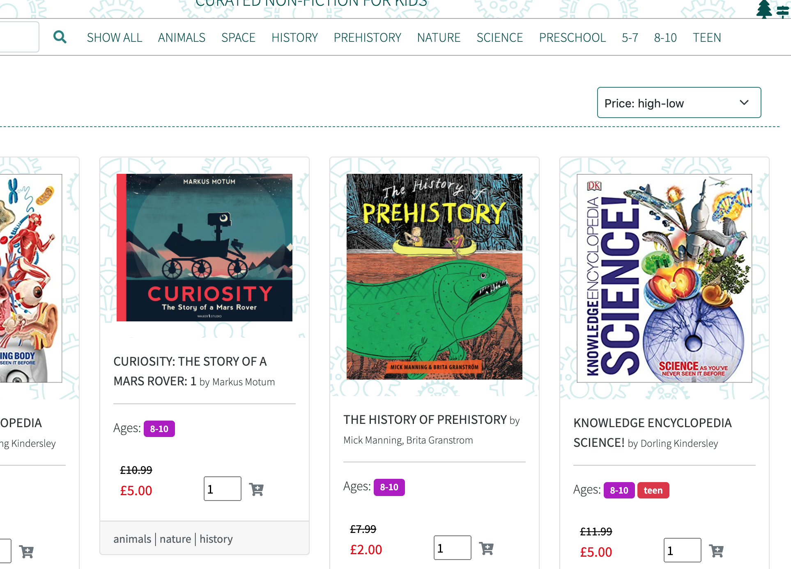

Add to basket buttons, with a quantity input, are available on each item that is dispayed on the main items page.

#### **2. "As a customer I want to be able read about the products in detail so I can	find out the price, author, subject and suggested age recommendation and read the description."**

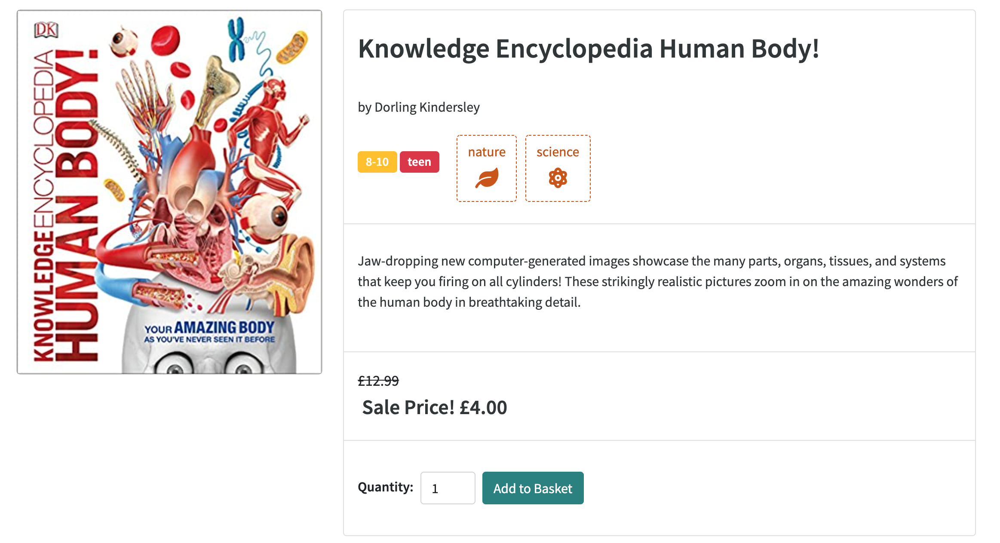

Users can click through to a dedicated item detail page from the main items page.

#### **3. "As a customer I want to be able to search by keyword so I can quickly find exactly what I'm looking for."**

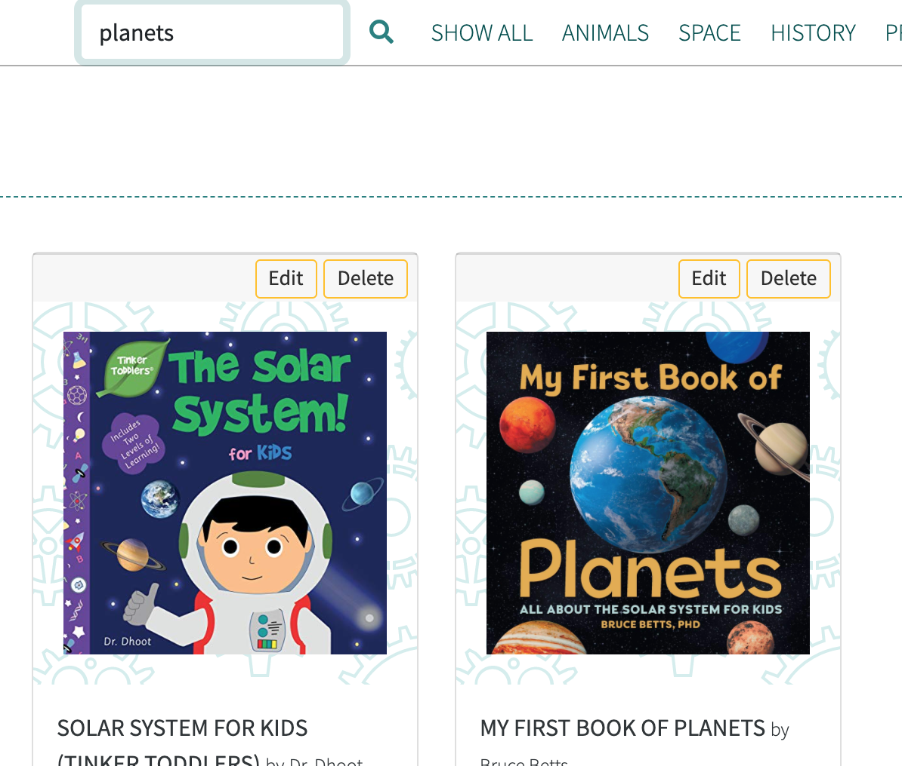

Users can search from the navbar, which remains available wherever the user navigates to. They can perform a keyword search for author first name, author surname, genre, title an description.

#### **4. "As a customer I want to be able to filter items by genre and age recommendation so that I can identify the most suitable item to buy."**

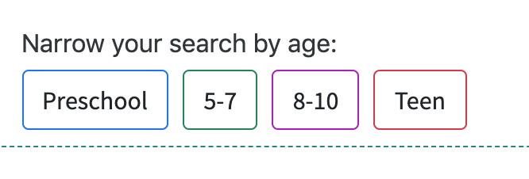
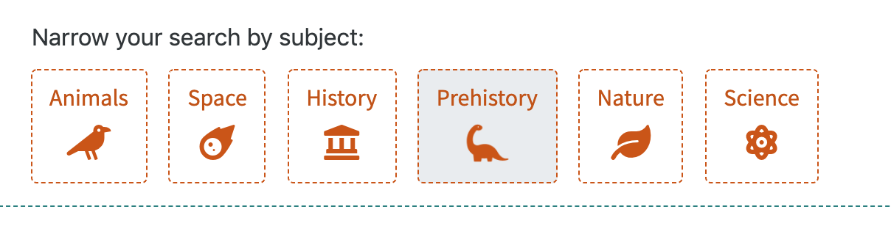

#### **5**. "As a customer I want to be able to sort, search and filter results by price so that I can find a suitable product within my price range."  

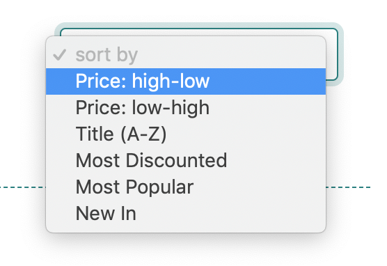

If a user selects a genre, they are presented with age-range buttons to further reduce their browsing options. Similarly, if they choose an age range, they are presented with genre icons to narrow down the results.

#### **6. "As a customer I want to be able to add a number of items to my basket directly from the search results so that I can buy items when I see them, without clicking through to individual item detail pages."**
#### **7. "As a customer I want to be able to add one or more of the same item from the item detail page so that I can buy what I want without navigating back to the search results."**

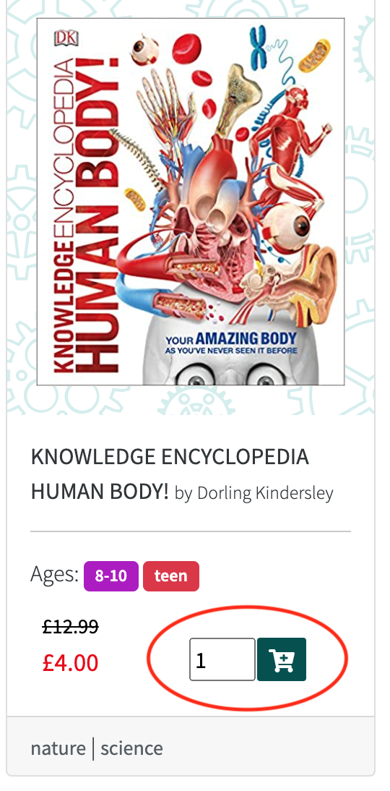

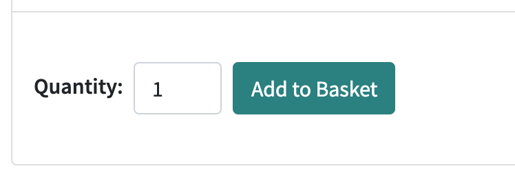

Clicking the button adds the desired quantity to the basket without redirecting the user to a different page.

#### **8. "As a customer I want to be able to remove items from my basket so that I can change my mind at the checkout."**

#### **9. "As a customer I want to be able to change the quantity of items from within my basket so that I can buy more or less of something without navigating back through the item listings."**

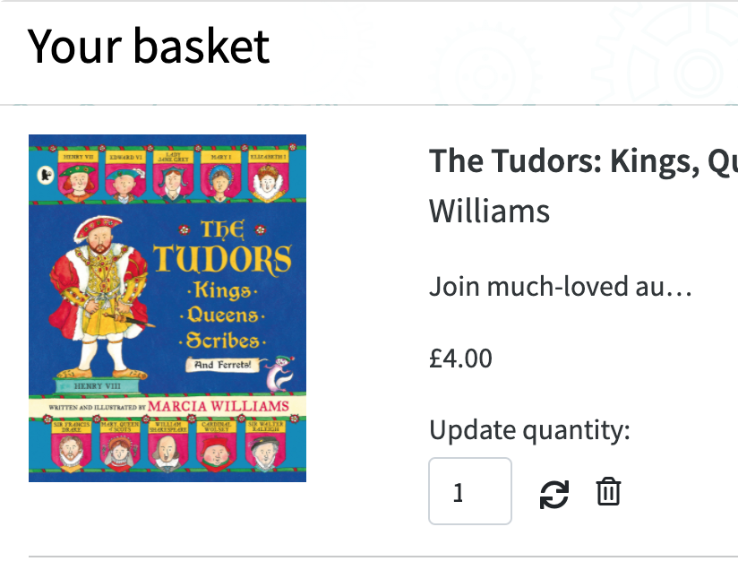

Users can navigate to their basket by clicking on the basket dropdown in the navbar. From here they can update the quantity of items in the basket, or remove an item entirely.

#### **10. "As a customer I want to be able to see my basket contents and total from wherever I am on the site so that I can avoid overspending."**

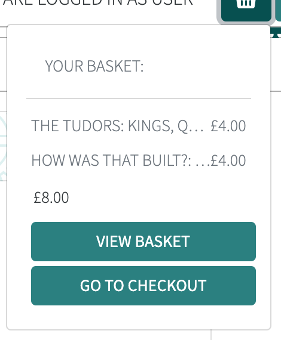

The navbar's basket dropdown menu summarises the basket contents, giving both item price and total basket cost (before shipping).

#### **11. "As a customer I want to be able to pay for my items without leaving the site so that I can have a simpler customer journey from start to finish."**

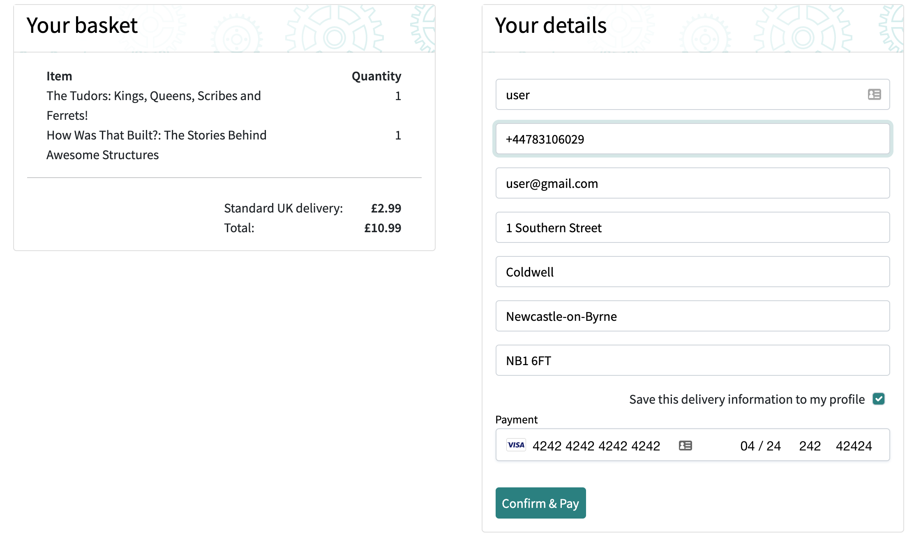

Basket details are recapped briefly on the checkout page, and customers can input all of their data and confirm their purchase on a single page.

#### **12. "As a customer I want to be notified if there is an issue with my payment so that I can easily identify and rectify the issue."**

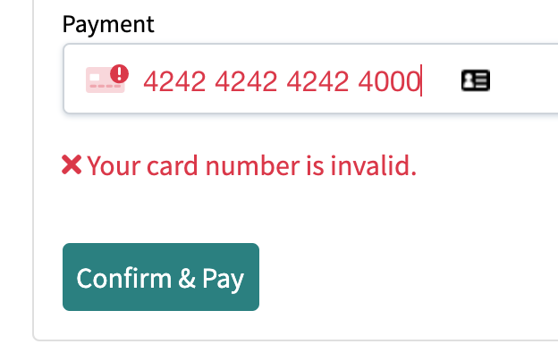

Specific error messages are displayed to the user if there is an error with the form, with the card details, or with the payment itself.

#### **13. "As a customer I want to be able to view my order history so that I can check what I've bought and how much I've spent."**

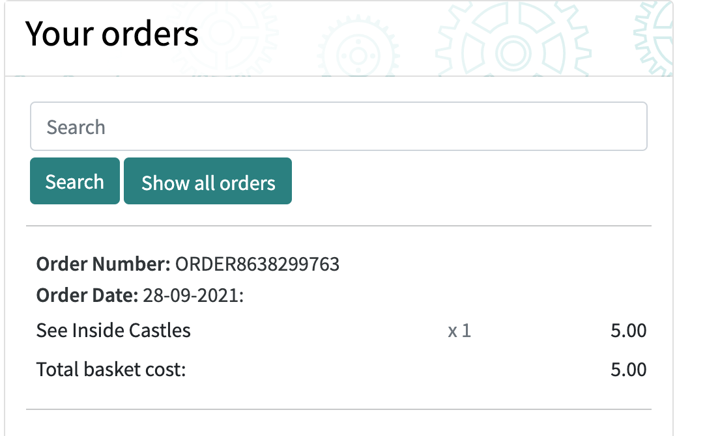

Users are able to view their entire order history via their account profile page, or search for a specific product, author or order number.

#### **15. "As a customer I want to be able to save my address details so that I don't have to re-enter it every time I visit."**

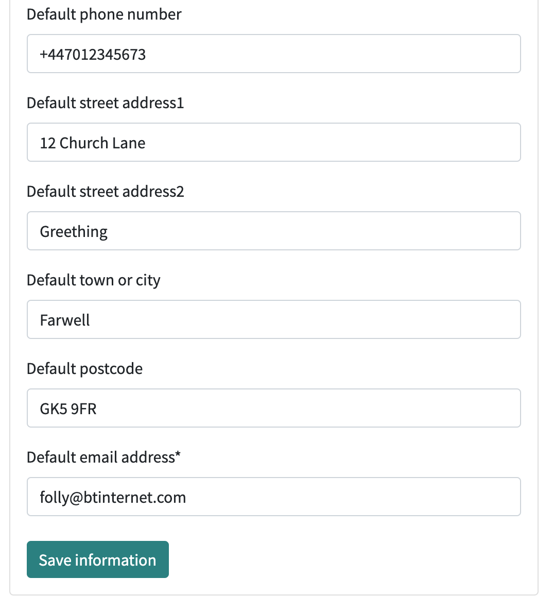

The account profile page provides a simple form for users to save their default information. They are also able to save or update this from the checkout page. If the information is already saved, it will be automatically populated on the checkout page.

#### **16. "As a customer I want to be able to log in and out from any page so that I can feel certain no-one else is able to view my account."**

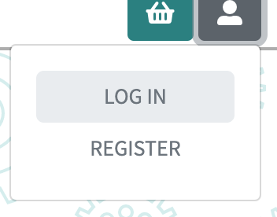
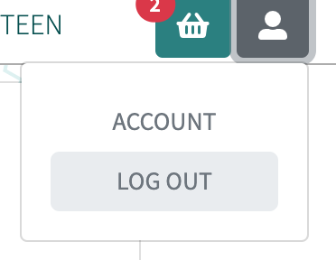

Account management buttons are available to users at the top-right, in the navbar. As the user scrolls down those buttons are repositioned in the lower nav using jQuery, so that they are always easily accessible.

#### **17. "As a customer I want to be able to change my password so that I can manage my account's security."**

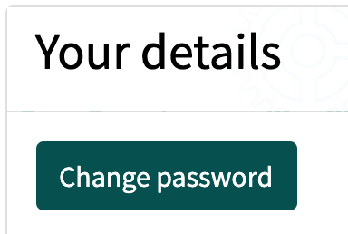
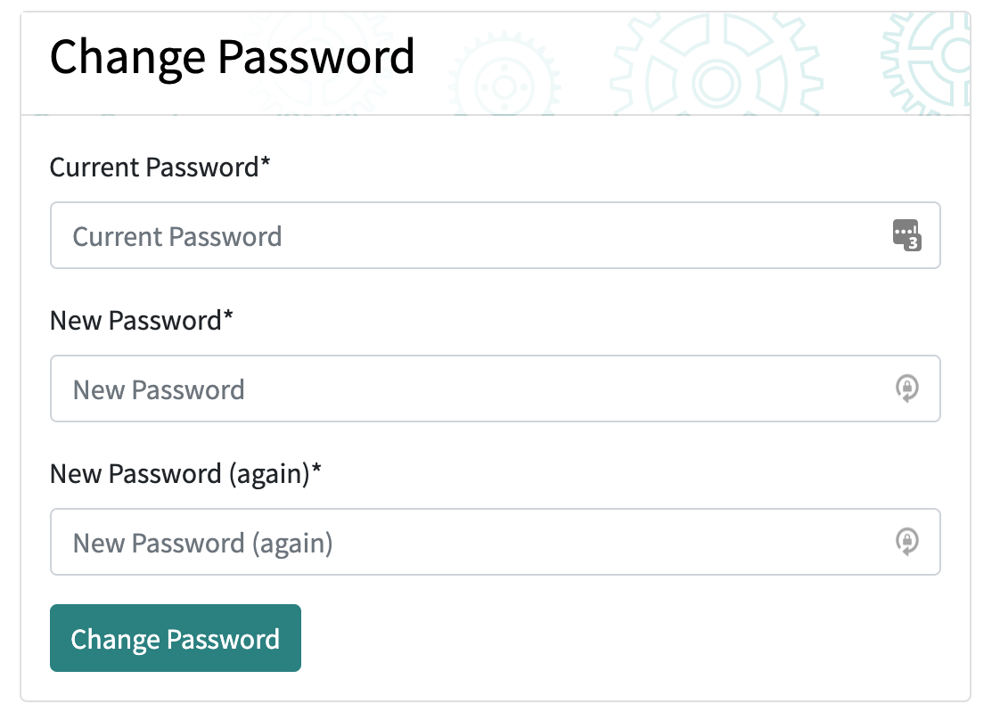

Users can change their password easily by navigating to their account page via the account management dropdown, and clicking the Change Password button. A simple process, managed by Allauth, allows users to update their password quicly and easily.

#### **18. "As a site owner I want to be able to add an item to the store so that I can quickly add new products as soon as they are available."**

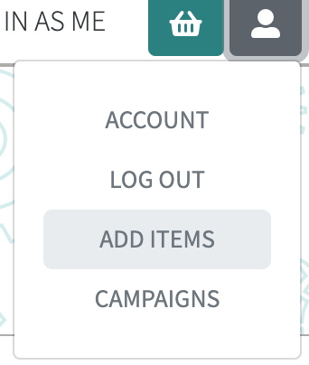
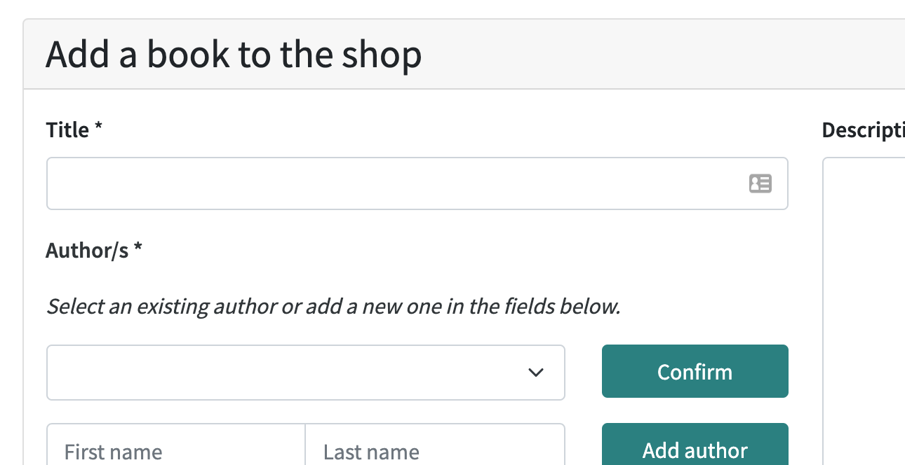

An add item button is available to logged-in staff users from the account dropdown menu. This takes them directly to the Add Item form.

#### **19. "As a site owner I want to be able to update an existing item so that I can keep product information up-to-date."**

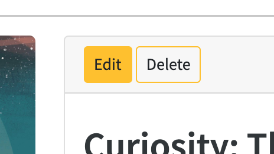
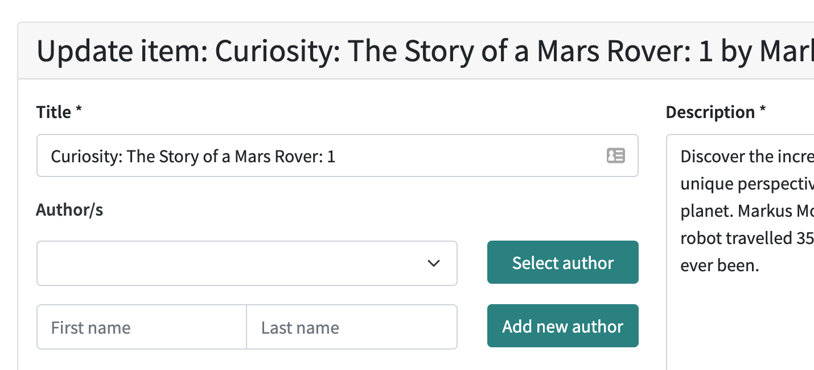

Items can be edited by logged-in staff members by finding the product and clicking on the Edit button which appears at the top of the main views listing from each item, and also the item detail page.

#### **20. "As a site owner I want to be able to delete and item from the store so that I can remove items that are no longer needed on the store."**

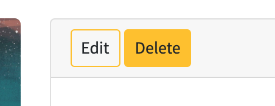

Similarly to the item edit functionality, items can be deleted either via the main items page or the item detail page. A delete-confirm modal ensures that accidental user clicks do not result in item deletion.

#### **21. "As a site owner I want to be able to create a sales campaign so that I can boost site revenue."**.

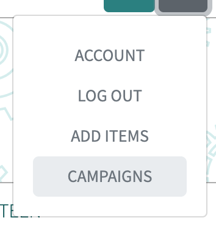

Logged-in staff users can navigation to a campaigns page. From here they can create a new campaign using a simple form that allows them to name the campaign, select products for inclusion and set a fixed price for those items.

#### **22. "As a site owner I want to be able to enable and disable campaigns in one click so that I can have a flash sale for short periods without much admin overhead."**

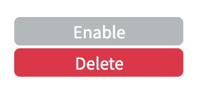
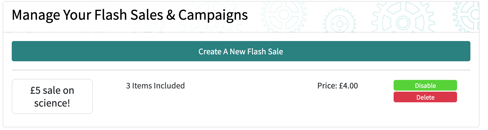

The campaign management page allows staff users to enable and disable campaigns at the click of a button. Included items retain their connection to a campaign until they are removed or the campaign is deleted. This ensures that campaigns can be quickly re-enabled as the items will not have been included in other enabled campaigns. Disabling a campaign simply reverts the items' prices to their base prices and vice versa.

Validation

Code validation was completed using the following online tools:

- JSHint for Javascript and jQuery
- W3C Markup Validation Service (HTML)
- W3C CSS Validation Service
- PEP8 Online (Python)
- Autoprefixer at autoprefixer.github.io was used to ensure the widest possible CSS cross-platform compatibility.

RUN AGAIN!